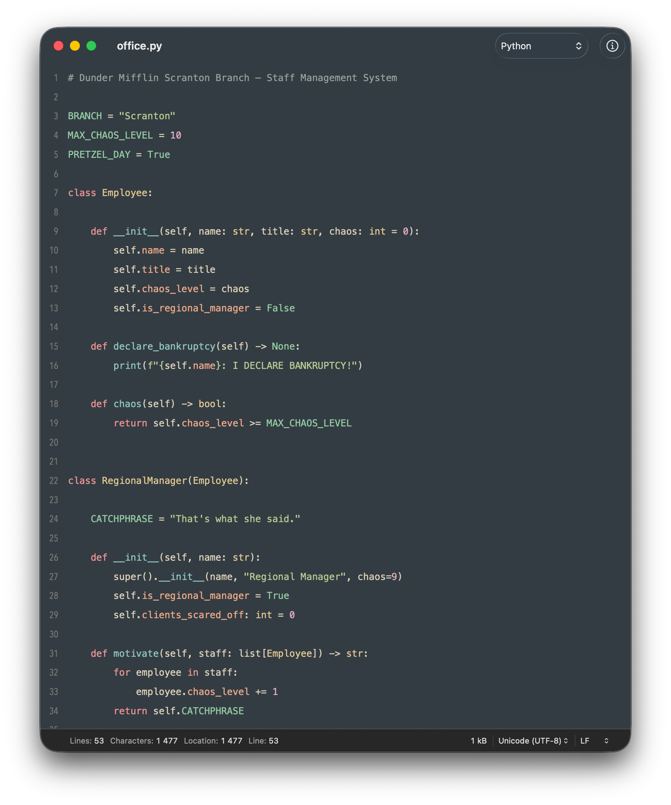
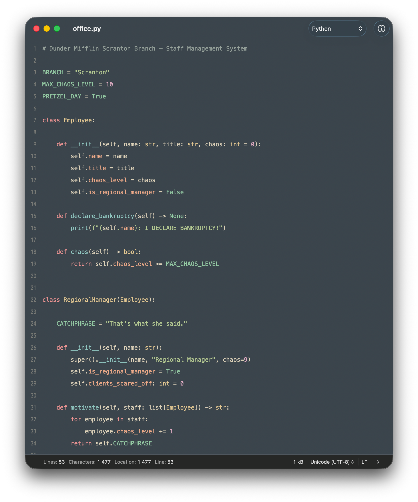
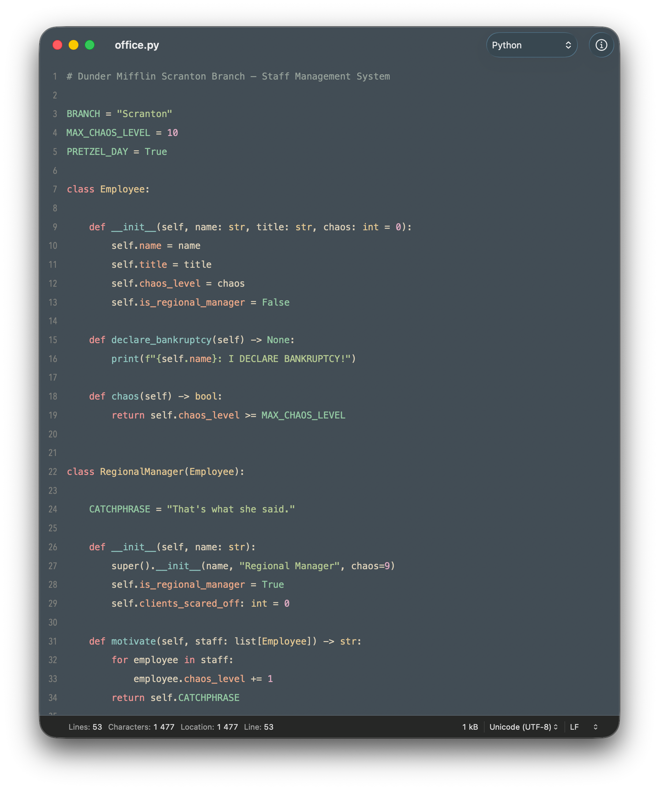
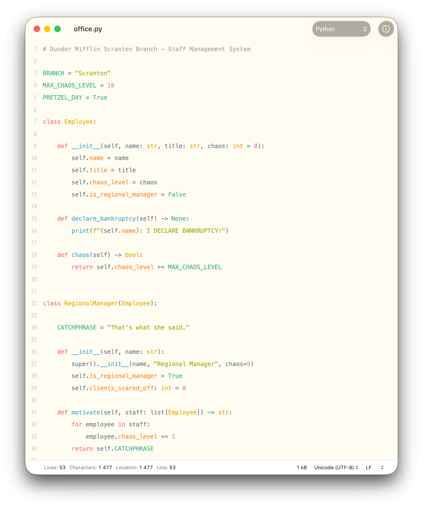
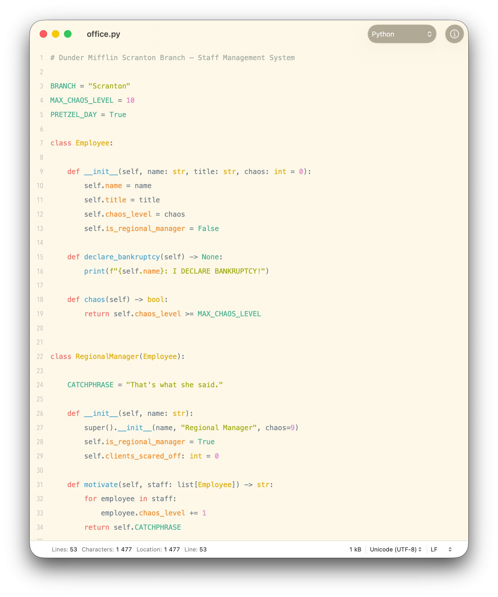
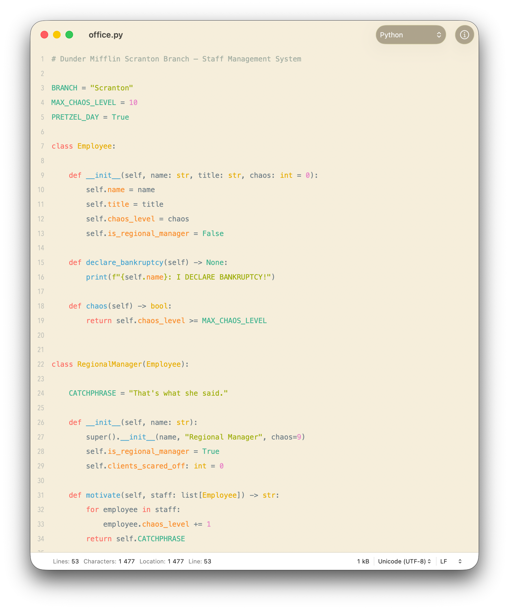

# 🌲 Everforest for CotEditor

> Everforest is a green-based color scheme; it's designed to be warm and soft in order to protect developers' eyes.

6 themes for [CotEditor](https://coteditor.com) based on the [Everforest](https://github.com/sainnhe/everforest) color scheme by [sainnhe](https://github.com/sainnhe).

## Previews

### Dark

<table>
  <thead>
    <tr>
      <th width="33.3%">Hard</th>
      <th width="33.3%">Medium</th>
      <th width="33.3%">Soft</th>
    </tr>
  </thead>
  <tbody>
    <tr>
      <td></td>
      <td></td>
      <td></td>
    </tr>
  </tbody>
</table>

### Light

<table>
  <thead>
    <tr>
      <th width="33.3%">Hard</th>
      <th width="33.3%">Medium</th>
      <th width="33.3%">Soft</th>
    </tr>
  </thead>
  <tbody>
    <tr>
      <td></td>
      <td></td>
      <td></td>
    </tr>
  </tbody>
</table>

Screenshots use [Meslo LG Nerd Font](https://github.com/ryanoasis/nerd-fonts/tree/master/patched-fonts/Meslo).

<details>
<summary>Sample code used in screenshots</summary>

```python
# Dunder Mifflin Scranton Branch — Staff Management System

BRANCH = "Scranton"
MAX_CHAOS_LEVEL = 10
PRETZEL_DAY = True


class Employee:

    def __init__(self, name: str, title: str, chaos: int = 0):
        self.name = name
        self.title = title
        self.chaos_level = chaos
        self.is_regional_manager = False

    def declare_bankruptcy(self) -> None:
        print(f"{self.name}: I DECLARE BANKRUPTCY!")

    def chaos(self) -> bool:
        return self.chaos_level >= MAX_CHAOS_LEVEL


class RegionalManager(Employee):

    CATCHPHRASE = "That's what she said."

    def __init__(self, name: str):
        super().__init__(name, "Regional Manager", chaos=9)
        self.is_regional_manager = True
        self.clients_scared_off: int = 0

    def motivate(self, staff: list[Employee]) -> str:
        for employee in staff:
            employee.chaos_level += 1
        return self.CATCHPHRASE


def pretzel_day_capacity(employees: list[Employee]) -> int:
    # Pretzel Day always exceeds normal branch capacity
    return len(employees) * 3


staff = [
    RegionalManager("Michael Scott"),
    Employee("Dwight Schrute", "Assistant (to the) Regional Manager", chaos=7),
    Employee("Jim Halpert", "Sales Representative", chaos=3),
    Employee("Pam Beesly", "Receptionist", chaos=1),
    Employee("Kevin Malone", "Accountant", chaos=5),
]

if PRETZEL_DAY:
    capacity = pretzel_day_capacity(staff)
    print(f"Scranton capacity today: {capacity}")
```

</details>

## Variants

Hard/Medium/Soft differ only in background contrast — Hard is darkest/lightest (highest contrast), Soft is closest to mid-tone (lowest contrast).

| Theme | Background |
|---|---|
| Dark Hard | `#272E33` |
| Dark Medium | `#2D353B` |
| Dark Soft | `#333C43` |
| Light Hard | `#FFFBEF` |
| Light Medium | `#FDF6E3` |
| Light Soft | `#F3EAD3` |

## Installation

### Via Terminal

**Mac App Store:**

```bash
git clone --depth=1 --no-tags https://github.com/vasylromanets/everforest-coteditor /tmp/everforest-coteditor
cp /tmp/everforest-coteditor/themes/*.cottheme ~/Library/Containers/com.coteditor.CotEditor/Data/Library/Application\ Support/CotEditor/Themes/
rm -rf /tmp/everforest-coteditor
```

**Direct download / Homebrew:**

```bash
git clone --depth=1 --no-tags https://github.com/vasylromanets/everforest-coteditor /tmp/everforest-coteditor
cp /tmp/everforest-coteditor/themes/*.cottheme ~/Library/Application\ Support/CotEditor/Themes/
rm -rf /tmp/everforest-coteditor
```

### Via Finder

Copy the `.cottheme` files into:

**Mac App Store:** `~/Library/Containers/com.coteditor.CotEditor/Data/Library/Application Support/CotEditor/Themes`

**Direct download / Homebrew:** `~/Library/Application Support/CotEditor/Themes`

`~/Library` is hidden by default. Open it in Finder via **Go → Go to Folder** (`⇧⌘G`) and paste the path.

### Via CotEditor

1. Download the `.cottheme` files from the [`themes/`](./themes) folder.
2. Open **CotEditor → Settings → Appearance**.
3. Drag the downloaded files into the theme list.

## Community Resources

The following are unofficial resources where you can find Everforest ports for other apps and tools:
- [Everforest Website](https://everforest.vercel.app)
- [Everforest Collection](https://github.com/neuromaancer/everforest_collection)

## License

[MIT](./LICENSE)
